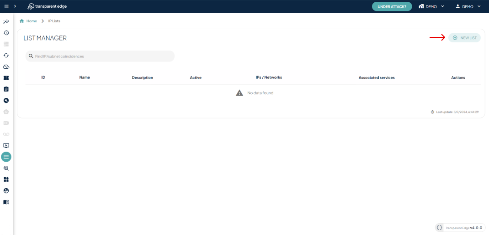
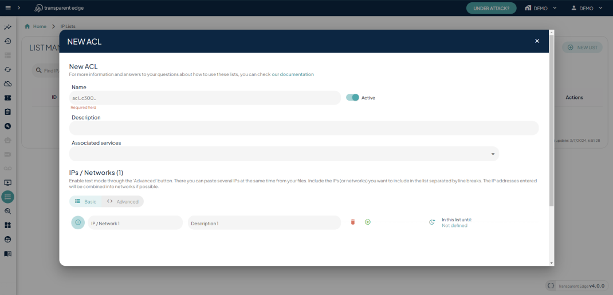

# Initial configuration

Adding IPs to a list is simple and intuitive using our [dashboard](https://dashboard.transparentcdn.com/).

First we must go to the "**IP Lists**" section in the left side panel, then click on the "**New List**" button, to create a new list.

<figure><figcaption>
"<strong>IP Lists</strong>" section
</figcaption></figure>

### Creating a list

Now we need to complete the list information:

* Name of the list
* The "Active" button indicates whether the list is currently in use or not
* Description to easily identify the list
* Services that will be associated with this list

#### Add IPs / Networks to the list

There are 2 ways of adding IPs to the list:

* **Basic mode**: Add IP / Network with an optional description and TTL
* **Advanced mode**: Paste several IPs at the same time from your files or include the IPs separated by line breaks

<figure><figcaption>
Creating Network ACL
</figcaption></figure>
