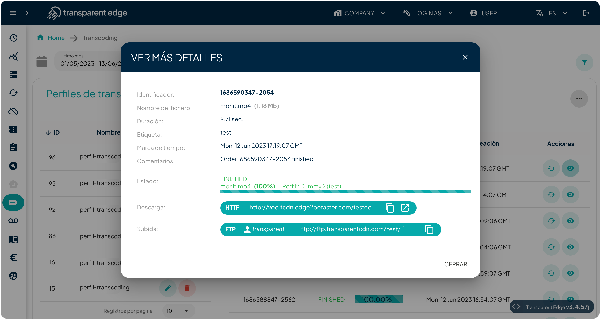

# Dashboard usage

You can also use the transcoding service from your dashboard. To do so, go to the "Transcoding" section in the side menu of the panel.

<figure><figcaption>
Location of transcoding in the menu.
</figcaption></figure>

\
Once in the dashboard, you will be able to view the jobs that you have already submitted to the [API](create-a-transcode-job.md) or created directly from the dashboard, along with their respective states. You will also have access to a list of transcoding profiles.

From the [dashboard](https://dashboard.transparentcdn.com/), you can create new transcoding jobs and transcoding profiles.&#x20;

## Transcoding profiles

Transcoding profiles are a great way to define how a video file gets converted. Think of them as templates that apply specific parameters to your video during transcoding: which codec to use, the bitrate, resolution, audio format, and so on. The profiles can be modified and deleted.&#x20;

<figure><figcaption></figcaption></figure>

### Video settings

Start by giving your profile a name so you can easily identify it later. Then configure the three core video parameters: the output format, the codec it will be encoded with, and the bitrate, which determines the quality and file size of the result. These three fields are required.

### Optional video settings

If you need to control the output dimensions, you can specify the width and height in pixels. You can also force a specific aspect ratio if you need the result to have fixed proportions regardless of the source video.

The **Restrict bitrate** option lets you cap the maximum output bitrate (the number of bits per second that can be transferred in a video), which is useful when you want to keep the file under a certain size or ensure compatibility with bandwidth-constrained environments.


Keep in mind that if you fill in the width and height fields, you won't be able to use **the custom watermark** or **video filter profiles**, as they are not compatible with a fixed output resolution.


### Audio settings

For audio, you can define the codec and the bitrate. As a general reference for most platforms and streams, common bitrate standards are 128 Kbps for standard quality and 192–320 Kbps for high quality.

### Custom profiles

Custom profiles let you add a watermark to your video, configure HLS output, and apply video filters such as scaling the resolution or changing the aspect ratio.

#### Watermark (overlay)

Overlays an image on top of your video. Typically used for logos or watermarks.

* **URL:** The image is downloaded from a public URL at transcoding time, so make sure it is publicly accessible. We recommend using a PNG with a transparent background so it blends naturally into the video.
* **Scale width:** Width in pixels to resize the overlay to before placing it on the video. Default: 128.
* **Scale height:** Height in pixels to resize the overlay to before placing it on the video. Default: 128.
* **Opacity:** Transparency level of the image. `0` is fully transparent, `1` is fully opaque.
* **Horizontal:** Sets the X position of the watermark on the video frame.
* **Vertical:** Sets the Y position of the watermark on the video frame.
* **Offset X:** Margin in pixels from the horizontal edge.
* **Offset Y:** Margin in pixels from the vertical edge.


Keep in mind that this profile type is not compatible with profiles that have a fixed output resolution set (**the width and height fields** in the video settings), nor with the **video filter profile.**


#### HLS segmentation (hls)

Converts the output to HLS format, the standard for adaptive streaming. The video is split into short segments and a `.m3u8` playlist is generated, which players use to request fragments based on the user's connection.

* **Segment duration:** Duration in seconds of each segment. Shorter values produce more segments and better adaptability to variable network conditions. Longer values require fewer client requests.
* **Playlist size:** Number of segments kept in the playlist. `0` = keep all (VOD). For live streams, values like 5–10 create sliding playlists.
* **Master playlist name:** Name of the master playlist file that references the quality variants. The player uses it as the HLS entry point.
* **HLS flags:** Extra HLS options that can be combined using '+' to change how the streaming files are generated. For example: `single_file` saves everything into a single file, and `append_list` adds new segments to the playlist instead of replacing it.
* **Pixel format:** Output pixel format. `yuv420p` is the standard for maximum compatibility. `yuv444p` offers higher quality but lower compatibility with players.
* **FPS:** _(Optional)_ Forces the output framerate. If not set, the original video framerate is preserved.
* **Scene threshold:** _(Optional)_ Sensitivity level for automatic scene change detection (and keyframe insertion). `0` = disabled. Disabling it is recommended for HLS, since keyframes are already controlled via the segment duration.
* **H.264 preset:** _(Optional)_ Controls the balance between encoding speed and file size/quality. Slower presets produce better compression and smaller files, but take longer to process.
* **H.264 profile:** _(Optional)_ Defines compatibility and encoding efficiency. `baseline` offers maximum compatibility, ideal for older devices. `main` strikes a balance between compatibility and quality. `high` provides the best compression and quality, but may not be supported on older hardware.
* **H.264 level:** _(Optional)_ Sets the maximum resolution and bitrate limits according to the standard. Important for ensuring the video plays correctly on specific devices.
* **Max bitrate:** _(Optional)_ The maximum bitrate the video can reach at any given moment (e.g. `"3M"`, `"800k"`). Together with buffer size, it helps maintain a stable data flow.
* **Buffer size:** _(Optional)_ Defines how much the bitrate can momentarily deviate from the max bitrate. Typically set to twice the max bitrate value.
* **B-frames:** _(Optional)_ Help reduce file size by referencing information from both previous and future frames. `0` = none, `1` = few (faster), `2` = more (better compression).
* **Ref frames:** _(Optional)_ Number of frames the encoder uses as reference when compressing the video. More reference frames means better compression, but also higher CPU and memory usage during playback.
* **Entropy coder:** _(Optional)_ Internal compression method. `0` = CAVLC, faster and compatible with basic devices (baseline profile). `1` = CABAC, better compression (reduces size by \~10–15%) but slower and more demanding, requiring main or high profile.


This profile is compatible with both overlay and video\_filter, so you can combine it with either of the other two.


#### Video filter

Applies transformations directly to the video image. Useful for generating lower-resolution versions, converting a horizontal video to vertical format (9:16), and more.

At least the output resolution or the desired aspect ratio must be specified.

* **Scale W:** _(Optional)_ Output width in pixels. Accepts `-2` to let ffmpeg automatically calculate the value that preserves the aspect ratio based on Scale H.
* **Scale H:** _(Optional)_ Output height in pixels. Accepts `-2` for automatic calculation based on Scale W.
* **DAR:** _(Optional)_ Forces the Display Aspect Ratio in the container metadata without rescaling the pixels (e.g. `"16/9"`, `"9/16"`, `"4/3"`). Useful for correcting anamorphic videos or converting between horizontal and vertical formats.
* **FPS:** Sets the frames per second of the output video. Useful when the source video has a variable or non-standard framerate, ensuring a more stable and consistent result.
* **Pixel format:** Defines the pixel color format of the video. Used to ensure compatibility, especially when the original format is not supported by the target device or platform.
* **Position:** Injection point in the ffmpeg command. Use `before` if the scaling should be applied before the base encoding, or `after` if it should be applied to the resulting stream.


Keep in mind that, like the overlay profile, this profile is not compatible with profiles that already have a fixed output **resolution set,** nor with the **watermark profile.**


## New transcoding job

Jobs are created through a four-step wizard. All steps must be completed before the job is submitted.

<figure><figcaption></figcaption></figure>

#### Origin

Define the source path from which the file will be downloaded. In this field, you must enter the full URL or storage path pointing to the source media file.

#### Destinations

You must enter the URL or storage path where the output file will be sent once it has been transcoded. Use the + button to add multiple destinations if you need the result delivered to more than one location simultaneously.

#### Jobs

Configure the transcoding tasks that will be executed against the source file. Each job entry defines a specific output format. You can add multiple jobs to generate several renditions from the same source in a single run.

**Label:** A human-readable identifier for this job entry (e.g. Iphone, HD-1080, Audio-AAC). Used to distinguish outputs when multiple jobs are configured.

**Filename:** Name of the output file that will be generated (e.g. watermark.mp4). Include the file extension matching the expected output format.

**Profile:** Select from the available profiles in the dropdown.

Thumbnails: When enabled, the service will extract still images from the transcoded video at defined intervals. Thumbnails are delivered alongside the output file to the configured destination.

**Priority:** Sets the processing priority for this job in the transcoding queue.

#### Notifications

Choose how you want to be notified when the job completes successfully.&#x20;

## Transcoding jobs

As for the transcoding jobs, there are two options:

1. If you click on the "View more details" icon, a modal will open where you can find more information about the transcoding process for the selected order.
2. If the transcoding workflow does not complete successfully, you have the option to relaunch the job. To do this, simply go to your dashboard, click on the "Transcoding" menu, locate the job you want to relaunch, and click the refresh button under the actions section.

<figure><figcaption>
Information about a transcoding job
</figcaption></figure>

And finally, at the bottom, you will find the consumption summary for each queried month.

