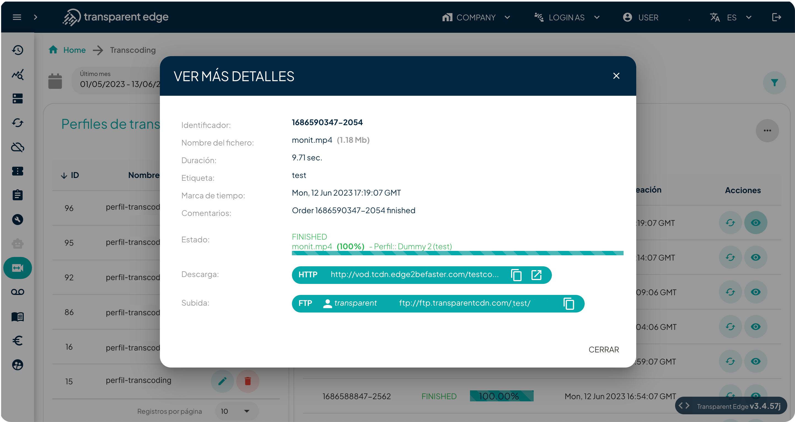

# Dashboard usage

You can also use the transcoding service from your dashboard. To do so, go to the "Transcoding" section in the side menu of the panel.

<figure><figcaption>
Location of transcoding in the menu.
</figcaption></figure>

\
Once in the dashboard, you will be able to view the jobs that you have already submitted to the [API](create-a-transcode-job.md) or created directly from the dashboard, along with their respective states. You will also have access to a list of transcoding profiles.

From the [dashboard](https://dashboard.transparentcdn.com/), you can create new transcoding jobs and transcoding profiles. The profiles can be modified and deleted. As for the transcoding jobs, there are two options:

1. If you click on the "View more details" icon, a modal will open where you can find more information about the transcoding process for the selected order.
2. If the transcoding workflow does not complete successfully, you have the option to relaunch the job. To do this, simply go to your dashboard, click on the "Transcoding" menu, locate the job you want to relaunch, and click the refresh button under the actions section.

<figure><figcaption>
Information about a transcoding job
</figcaption></figure>

And finally, at the bottom, you will find the consumption summary for each queried month.

