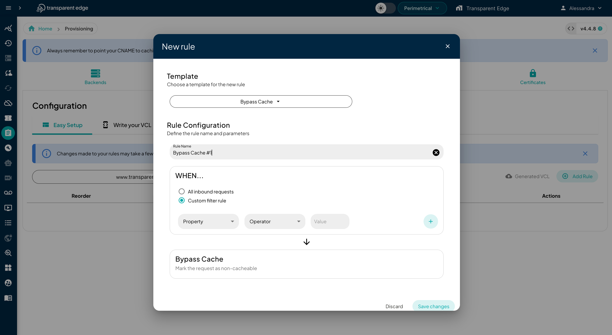

# Configuration

Our dashboard provides two configuration methods. The first one, **Easy Setup**, is a simple rule engine that allows you to configure the system without dealing with VCL code. The second option gives you the ability to **write your VCL code**, enabling a more detailed customization of the system’s behavior.

### Easy Setup

The Easy Setup is based on 'if-then' conditional logic. When the conditions of a defined rule are met, a specific action is applied. This system allows you to configure key actions on your sites in a simple and agile way with just a couple of clicks.

To create a new rule, we must select the site where our configuration will be implemented. Once selected, click the '**Add Rule'** button, which will open a modal displaying the rule templates grouped by category.

<figure><figcaption></figcaption></figure>

In **Cache & Performance** we can find:

* **Bypass cache:** Select the pages where requests skip the cache and go straight to the origin server.
* **Cache time for CDN:** Specify the TTL for the request.
* **No cache:** Disable caching for requests.

In **Headers & Response** we can see:

* **Add header to the response:** Add a custom header to the HTTP response before it is sent to the user.
* **Header rewrite:** Rewrite any response header before inserting in the cache.
* **Unset header:** Unset an origin header.

In **Routing & Redirects** are:

* **Assing backend:** Assign each site to its corresponding backend for precise and controlled routing.
* **Permanent redirect (301):** Set up a permanent redirect for your website.
* **Temporary redirect (302):** Set up a temporary redirect for your website.
* **Redirect:** Redirects users to another page.
* **Redirect HTTPS:** Redirect HTTP to HTTPS depending on the host name.

In **Security & Access Control** we have:

* **Request blocking:** Block the selected request with an error code.
* **Add exception to the WAF:** A configuration that allows the WAF to bypass specific rules, preventing the blocking of allowed requests or behaviors.
* **Rate limit:** a mechanism that restricts the number of requests a client can make to a server within a given time period.

With the template already selected, we will choose whether the rule will apply to all inbound requests or, alternatively, if we want to define it for a custom filter rule. In the latter case, we must fill in the required values. Once everything is completed, we save, and our new rule will be implemented.

From the rules table, we can edit, delete, and deactivate the rules that have already been created.

### **Write your VCL code**

Our CDN uses a modified version of the Varnish Configuration Language (VCL), a powerful language that will enable you to customize your site behavior.

A table will be displayed with the history of all configurations.

The current and active configuration is the one marked with a green tick under the "Status" header. You can see when that configuration took effect under "Deployment date".

You can perform the following actions on any of the configurations:

* **`View`** - Opens a read-only view of the configuration, where you can check the code and compare with other configurations.
* **`Duplicate`** - Opens an editor to deploy a new configuration prefilled with the code of this particular configuration.
* **`Back to production`** - A quick way to deploy an older configuration again, it's a "rollback" button.

#### Deploying a new configuration

To deploy a new configuration, click on the "ADD VCL CONFIG" button or, if you want to edit over an older configuration, use the "Duplicate" button instead.

An editor will be displayed where you can edit the VCL code or you can copy it to your favorite editor and paste it later.

**AI Assistant**

Within the **new configuration creation modal**, an **AI assistant** is included that allows you to generate **VCL code** based on a description of the desired behavior.&#x20;

The assistant translates the request into VCL code, which can then be **copied and pasted into the VCL editor** below, where the user can **validate it, modify it manually if needed, and deploy the configuration**.

<figure><figcaption></figcaption></figure>

The editor embeds some autocompletion that can be activated using the `CTRL` key.

<figure><figcaption></figcaption></figure>

When you're done editing the configuration, click on "Save". The configuration will be checked for syntax errors and, if any are present, an error will be shown. For example, here we tried to use `req.http` in the `vcl_backend_response` subroutine which only accepts `bereq.http` and `beresp.http`:

<figure><figcaption></figcaption></figure>

Otherwise, if the code is correct. the deployment will be queued and a clock will be displayed in the status of that configuration. Deployments usually take between 2 and 7 minutes to fully propagate.


Remember that everything that you can do on our dashboard is available on our [API](https://api.transparentcdn.com/docs).

