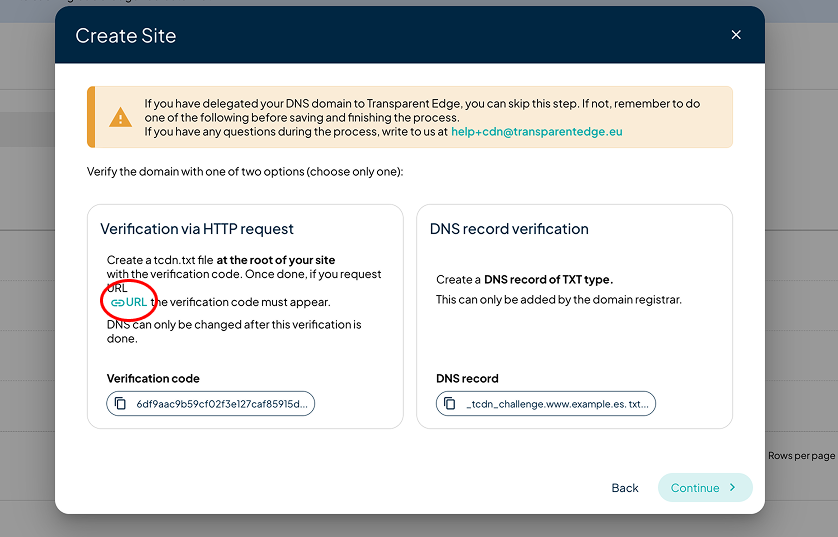

# Sites

In this section, you'll be able to view/add or delete the sites managed by our CDN.

Provisioning -> Sites

<figure><figcaption></figcaption></figure>


An important notice that you can see in this section is the CNAME where you must point your sites to your DNS configuration.


### Adding a new site

Adding a new site requires a verification of ownership of the domain being added, which is a security measure. If you have any doubts or need assistance, don't hesitate to contact our support [help+cdn@transparentedge.eu](mailto:help+cdn@transparentedge.eu).

The verification process can be carried out in two ways:

**Verification via HTTP request**

You must create a `tcdn.txt` file at the root of your site with the verification code provided by the system. Once done, through the URL we provide you can check that the verification code appears in it. DNS can only be modified once this verification has been completed.

<figure><figcaption></figcaption></figure>

**DNS record verification**

In this case the system provides a unique code or text that must be copied. With it, you need to add a new TXT record in the place where the domain management is carried out. This way our system will query your domain's DNS and confirm that you are the owner by finding said record.

### Delegate the rest of the configuration?

From this point on, if you wish, we can take care of everything else.

<figure><figcaption></figcaption></figure>

\
If you choose to do so, we will automatically locate where your current backend is, create a new one on the platform, set up the configuration to associate that site with that backend, generate and upload an SSL certificate automatically. So that all you need to do is update your DNS records.

We will also handle the backend configuration through VCL settings, specifying the origin server where your website is hosted, and set up the HTTP to HTTPS redirect.


In the event that your site has not been verified within 24 hours after having selected this option, all the configuration created automatically will be deleted.


**What if my domain is on another CDN?** You will simply need to confirm the CDN migration and we will take care of everything else.

If you choose to do it yourself, remember that it is important to carry out the same steps manually.

### Relocate site

When relocating a site, it is transferred from the current company to a target company. To do so, click the Relocate button and select from the dropdown the company you want to move the site to. Once confirmed, the site will be associated with the new company.

<figure><figcaption></figcaption></figure>

### What is the lock icon next to my sites?

If the padlock appears open, your site does not have an SSL certificate configured. If it appears closed and green, your site has a valid HTTPS configuration. By clicking on the open padlock, you can [configure a certificate for your site.](ssl.md)

### I can't verify my site / I have to add a lot of sites at once

If you have any problems adding new sites, please contact our support. We can add sites in bulk and/or bypass the verification if there are any issues: [help+cdn@transparentedge.eu](mailto:help+cdn@transparentedge.eu).
