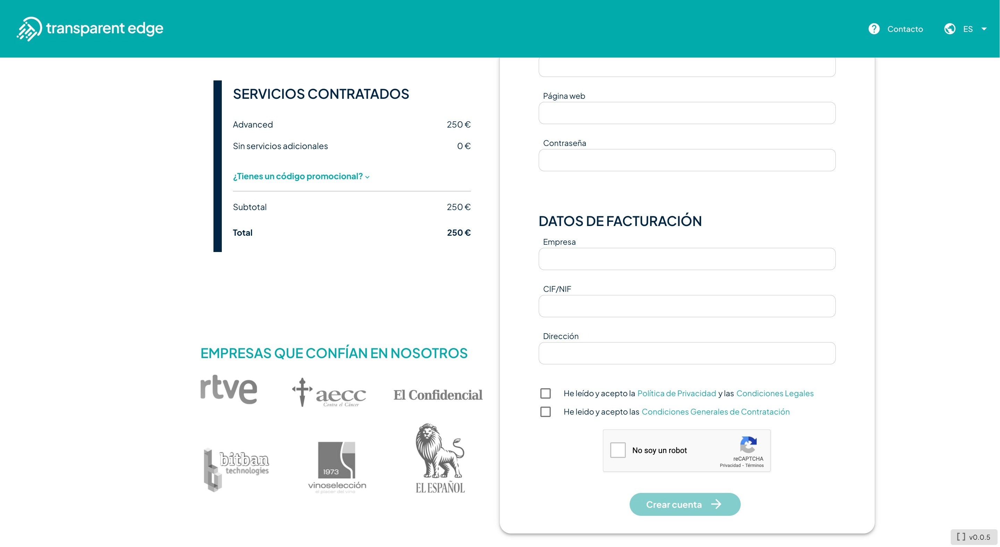

# Sitios o dominios

En este apartado podrás ver todos los sitios configurados, añadir nuevos y activar la gestión automática de certificados SSL si lo deseas.

Si has seguido el asistente inicial, ya tendrás al menos un sitio configurado y verás algo similar al siguiente ejemplo:

<figure><figcaption></figcaption></figure>

Aquí se mostrarán todos los sitios configurados. Si tienes muchos, puedes filtrar con el buscador ubicado a la izquierda y ver cuáles tienen activada la gestión automática de certificados (en ese caso, el candado estará cerrado).


Un detalle importante es el aviso de la parte superior, que nos indica dónde tendremos que [apuntar el CNAME](https://docs.transparentcdn.com/getting-started/faq/apuntando-el-dns) del sitio. Aunque para que todo funcione correctamente, primero terminaremos toda la configuración relacionada en la plataforma de autoprovisión.


### Añadir Sitio

Añadir un sitio nuevo es un proceso sencillo, pero por motivos de seguridad se debe validar la posesión del dominio. Este proceso se explica detalladamente cuando pulsas sobre _**Añadir sitio**_,. Si tienes cualquier problema, no dudes en contactar con nosotros en [soporte@transparentedge.eu](mailto:soporte@transparentedge.eu)

<figure><figcaption></figcaption></figure>

<figure><figcaption></figcaption></figure>

Una vez revisados los requisitos y tras haber cumplido uno de ellos, pulsa "Guardar y finalizar", al hacerlo se realizará la validación necesaria y si todo es correcto el sitio quedará registrado.

### Gestión automática de certificados


Para más información sobre la gestión de certificados o para una gestión avanzada (por ejemplo, obtener certificados mediante _challenge_ DNS) [consulta este apartado](https://docs.transparentedge.eu/getting-started/dashboard/autoprovisionamiento/ssl).


Si lo prefieres, podemos llevar la gestión de certificados automáticamente desde nuestra plataforma. Los certificados de tu sitio estarán firmados en ese caso por [Let's Encrypt](https://letsencrypt.org/).

Para activar esta opción, pincha en _Acciones_ sobre el candado del sitio que quieras activar, el sitio web debe apuntar a la CDN para que se pueda obtener el certificado correctamente.

.png>)

<figure><figcaption></figcaption></figure>

Ahora solo tendrás que pulsar sobre _**Quiero gestionar automáticamente el SSL para este site**_ para iniciar el proceso. No tardará más de cinco minutos en activarse.

.png>)

Si el certificado se genera correctamente, lo podrás ver en el apartado de "Certificados", tras lo cual se renovará automáticamente cuando vaya a caducar, siempre que el dominio siga apuntando a la CDN.
