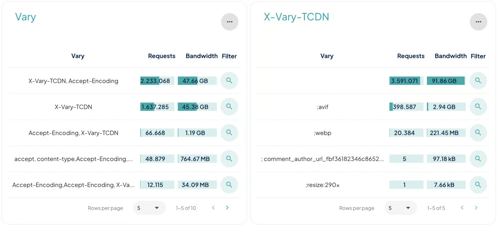

# Backend Analytics

## Backend Analytics

If you have advanced analytics enabled, you can find here a comprehensive set of statistics about the relationship between the CDN and your backend.

As with the other Transparent Edge panels, you can narrow your search by dates (and times) and, of course, filter while browsing the information or before viewing it.&#x20;

<figure><figcaption></figcaption></figure>

Likewise, you can customize the widgets according to your needs, adding more or replacing the less frequently used ones with others that are more useful for your business. You can arrange the widgets according to your preferences: click and drag!

<figure><figcaption></figcaption></figure>

#### Response times

All this information makes it possible to detect issues related to bottlenecks and potential latencies in the content delivery chain, as it provides specific data on processing times at various stages of the CDN’s handling in relation to your backend:

<figure><figcaption></figcaption></figure>

1. Time Start
   * It is the moment when the CDN node begins processing the request.
   * It marks the starting point for measuring all subsequent times. Ideally, it tends to zero.
2. Response Time
   * It is the total time elapsed from when the CDN nodes send the request to the origin until the origin finishes sending the response back to the CDN node.
   * It is composed of the sum of several intermediate times, such as connection, fetching data from the backend, and internal processing (including TTFB and others).
3. Time to First Byte (TTFB)
   * It measures the time span from the start of the request until the arrival of the first byte of the response.
   * It is a critical part of the Response Time, as it reflects the initial latency by combining the connection time and the backend’s delay in starting to respond.
4. Time Connected
   * It indicates the time it takes to establish the connection with the backend.
   * It is the phase preceding the actual backend request, and its duration influences both the TTFB and the total response time.

<figure><figcaption></figcaption></figure>

5. Time Fetch
   * It refers to the time the CDN node takes to retrieve the content from the backend. This covers the period from when the request is sent until the complete response begins to be received.
   * It is a component within the Response Time, closely tied to the time the backend takes to process and respond to the request.
6. Time Beresp (_backend response_)
   * It is related to the backend response and may include the time to receive the headers or the complete response (header and the initial part of the body).
   * It overlaps with Time Fetch, as both measure aspects of the interaction with the backend, although Beresp may be more focused on the actual response.
7. Time BerespBody
   * It specifically measures the time taken to receive the body of the response from the backend, **once the headers have already been received**.
   * It is a subdivision of the backend’s response time; while Beresp may include the overall response, BerespBody focuses on the complete transfer of the content.
8. Time process
   * It represents the total time the CDN node dedicates to processing the request internally. This includes evaluating the request, interacting with the cache, connecting to the backend, and any additional logic applied before sending the response.
   * It encompasses all processing stages within the CDN node, directly impacting the final Response Time.

<figure><figcaption></figcaption></figure>

9. Time Error
   * This time relates to error handling. It may represent the interval during which an error in communication is detected and managed (for example, when the connection to the backend fails or another error occurs during processing).
   * Although it is not part of the “ideal” flow of a successful request, it is crucial for diagnosing bottlenecks or failures in the process. It differs from the previous times because it is activated in exceptional situations and helps isolate issues in communication or processing.

#### Vary headers

The HTTP header **Vary** indicates which header fields should be considered variable when a file is requested from the cache, and it helps servers determine how to match the headers of future requests to decide whether a cached response can be used instead of requesting a new one from the origin server.\
This header is useful for delivering content optimized for different devices or user agents, ensuring that users access the correct version of a web page for their device.\
However, if the Vary header is not configured correctly, it can reduce the benefits of the caching system and lead to excessive resource usage.

**X-vary-tcdn** is a header that Transparent Edge includes by default in Vary (hidden) and is used to create cache variants without needing to manipulate the standard Vary header.

With this information, you will be able to compare and track the behavior of these headers.

<figure><figcaption></figcaption></figure>

#### Information concerning the Backend

These two widgets refer directly to the backend. They provide information on requests to the origins, whether from instances that listen and serve or from virtual hosts.

<figure><figcaption></figcaption></figure>

#### Cache Control

Here we can visually observe how many requests (and their consumed bandwidth) belong to the different cache-setting parameters, including non-cached items.

<figure><figcaption></figcaption></figure>

#### ASN & Referer

From which network (ASN) has your traffic originated, and with what volume of requests and bandwidth?\
Would you like to know how many requests and how much bandwidth a request with a specific `referer` has consumed?

<figure><figcaption></figcaption></figure>
