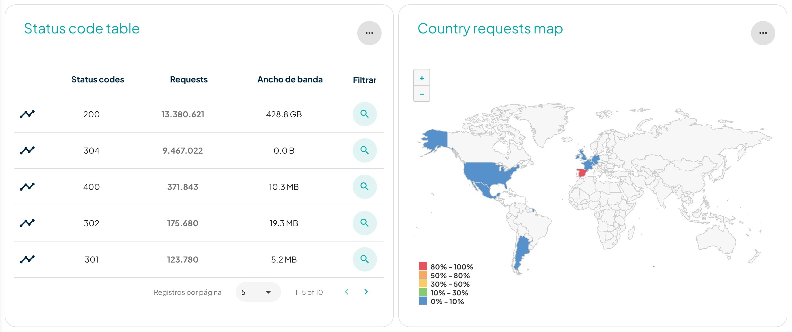
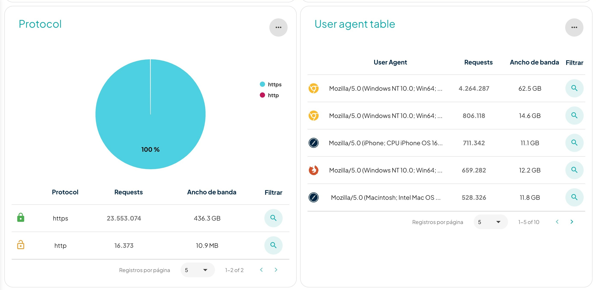
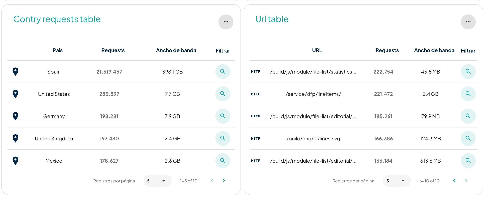
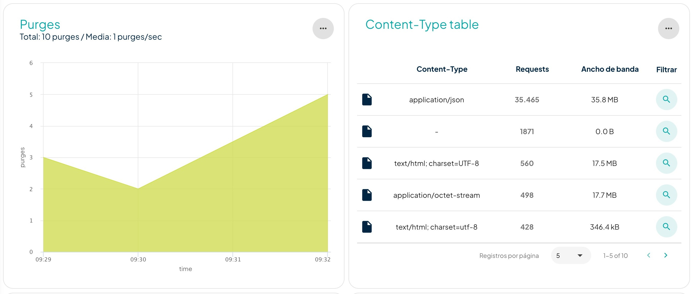
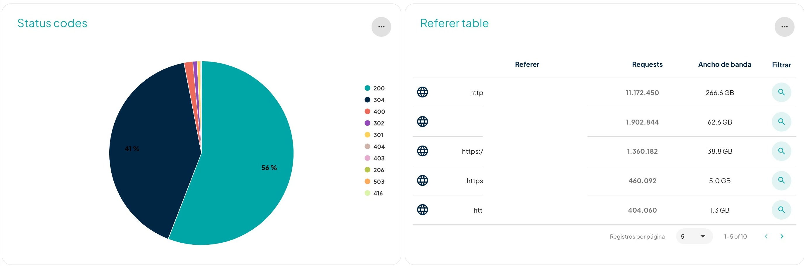

# Analítica

En esta página encontrarás más información actualizada y en tiempo real, muy valiosa para tu negocio. A diferencia del histórico, la analítica tiene una retención máxima de datos de las últimas 36 horas (paras visualizar información más antigua, puedes consultar en el histórico).&#x20;

Se puede filtrar según las necesidades, pero por defecto se aplica a la hora previa al momento consultado. El periodo máximo de tiempo que se puede aplicar en los filtros es de seis horas.&#x20;

El panel se puede personalizar de acuerdo a tus necesidades. Muestra las siguientes opciones:\

Encontrarás también la información de los _requests_ y ancho de banda:

Después se despliegan las gráficas del _hit ratio_, donde está toda la información de la eficiencia de la caché. Así, muestra los objetos que no han logrado ser cacheados (_miss_), los objetos caducados (_expired_) y los que estaban caducados y se han servido a partir del objeto caducado (_stale_). Y conjuntamente, según la configuración, se puede visualizar todo el tiempo de respuesta (_response time_) de las peticiones.

Los siguientes gráficos muestran los códigos de respuesta que han tenido todas las peticiones que ha recibido el _site_ y de qué lugar geográfico han venido esas peticiones.

Los siguientes gráficos muestran qué protocolo se está utilizando (HTTPS o HTTP) y de dónde vienen las peticiones en términos de dispositivos:

Las peticiones por país y las URL más pedidas de cada _site_ las encuentras aquí:

El gráfico siguiente muestra todos los purgados que realizan los clientes a través del panel. A su lado encuentras la tabla de todos los contenidos que tiene cada _site,_ cuántas _requests_ recibe y cuánto ancho de banda consume.

El gráfico de códigos de status (S_tatus codes_) permite visualizarlos. La tabla de referencias (_Referer table_) muestra de qué URL vienen las peticiones.

La tabla _IP Address table_ muestra las IP de las que proceden las peticiones. El gráfico _Content Type,_ por su parte, permite visualizar la información sobre los contenidos que tiene cada _site_.

 (1).png>)


Recuerda que todo lo que puedes hacer desde nuestro [_dashboard_](https://dashboard.transparetncdn.com)_,_ puedes hacerlo también desde nuestro [API](../faq/glosario/api.md).

