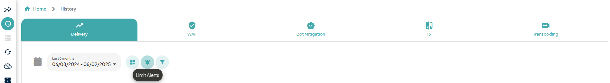
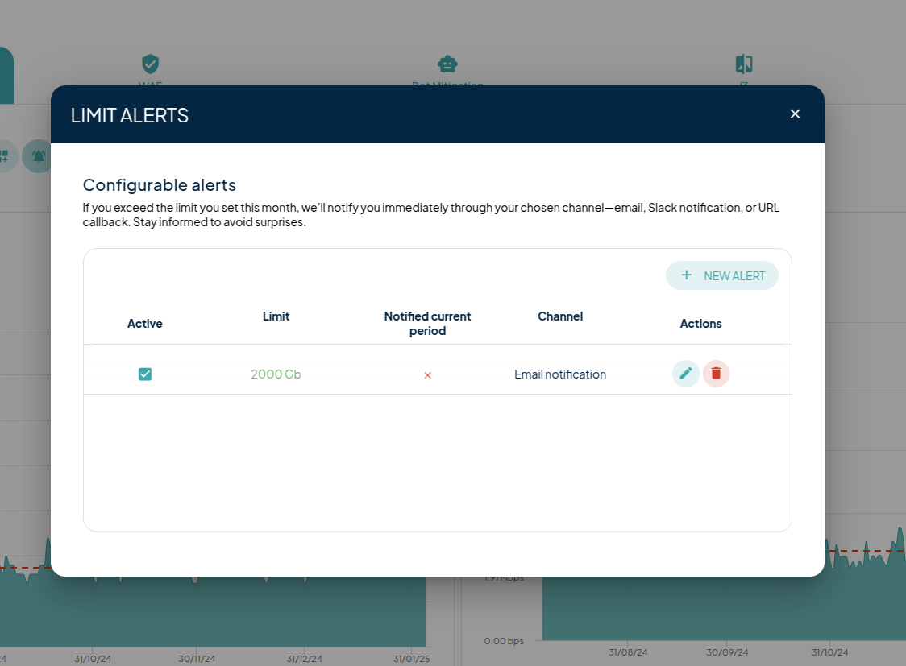

# Historic

This page contains all the historical information of the service provided by Transparent Edge.&#x20;

The last six months are displayed by default but you can filter by the last year, month or week, or by specific website.&#x20;

Depending on the filter chosen, all the information panels are recalculated. All the graphs and information provided can also be downloaded in PNG, SVG or CSV format by clicking on the top left of each panel.

If you need to share information already filtered, you can copy the link and send it to another user to view the same information.&#x20;

The first and second panels offer more detailed information on requests per second and bandwidth, itemized by site and time period. The panel normally displays information for today. It can also be filtered so that they are displayed together, showing the total for all sites, or separately, showing all graphs stacked to count the total requests per second and bandwidth of all sites linked to Transparent Edge.

<figure><figcaption></figcaption></figure>

The third and fourth panels show the information from the first and second panels (request per second and bandwidth) but displayed as a pie chart, giving more graphic visualization of this information.

<figure><figcaption></figcaption></figure>

After these graphs, the monthly bandwidth consumption information and requests received are displayed, providing our customers with information on their consumption. With this data, it is possible to make forecasts of future consumption for the current month, which is valuable information for all company departments.

<figure><figcaption></figcaption></figure>

If you have more services contracted with Transparent Edge, you can view their history by changing the option at the top of the panel. There, you will be able to see all the consumption of each service over a period of time.

### Consumption Alerts

<figure><figcaption></figcaption></figure>

At the top of the page, you will find the **"Limit Alerts"** button, which allows you to create a new consumption alert for your service. This alert is designed to notify you when your service's consumption exceeds a predefined threshold.

You can customize the alert to trigger specific actions, such as:

* Sending an **email notification**. Your email notifications must be activated in the [notification panel](https://dashboard.transparentcdn.com/user/notifications) to receive alerts.
* Delivering a **Slack notification**.
* Forwarding the alert data in **JSON format** to a specified URL.

This feature ensures you stay informed and can take timely action to manage your service consumption effectively.

<figure><figcaption>
Limit alerts widget
</figcaption></figure>


Remember that everything you can do from our [dashboard](https://dashboard.transparentcdn.com/auth/login?redirect=%2F), you can do from our [API](https://docs.transparentedge.eu/v/english/guias/api).

