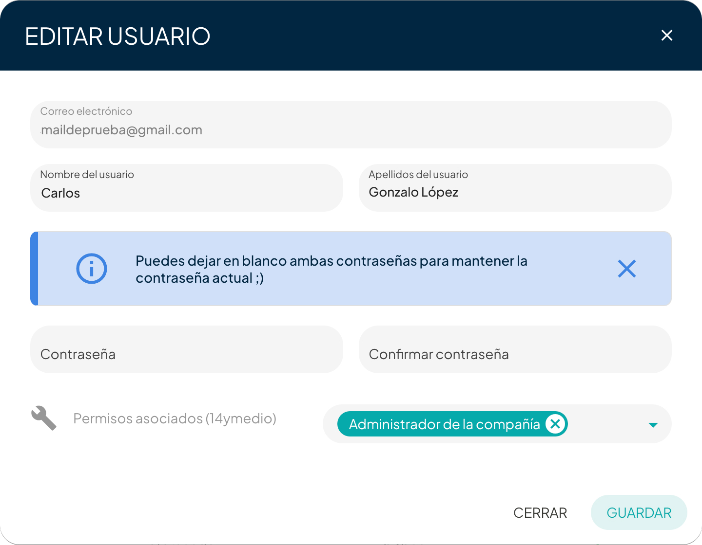
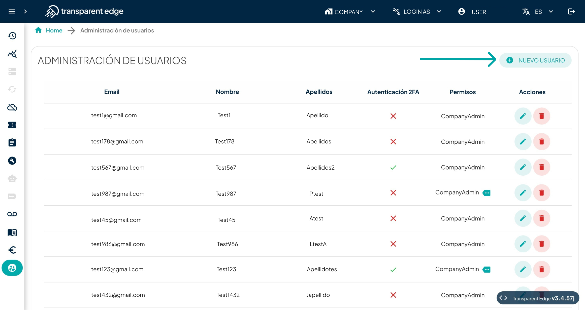

# User management

To access the User Management section, click on the icon that depicts a user, located at the bottom of the side panel.

From this section, you will be able to change user permissions within the company, edit their information, delete user profiles, or create new users. You can also view the permissions associated with each user and check if they have enabled 2FA (Two-Factor Authentication).

### Edit User

Any user within the company can be edited, and also deleted, using the buttons located on the right-hand side under actions.&#x20;

From the pop-up window, you can edit the user's first name, last name, and password, as well as the associated permissions that grant access to different actions and sections of the dashboard.

<figure><figcaption></figcaption></figure>

### Create New User

The process of creating a new user is very simple. The button to do so is located in the upper right corner.

<figure><figcaption></figcaption></figure>

Once the modal is displayed, you need to complete the required information: the email of the new company member, their first name, last name, the permissions they will have associated with their account, and assign them a password that the new user can later change.

After completing all of this has been done, the new user will receive an email in their inbox with all the information needed to access the dashboard. The company administrator will be able to manage all user information from the 'User Management' section.
