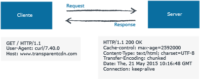
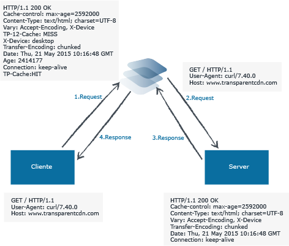

# HTTP, ¿cómo funciona?

Los sistemas de caché como Transparent Edge pueden aportar infinidad de ventajas a tu sitio web, entre las que destacan la reducción de los tiempos de la carga de la páginas, la absorción de grandes volúmenes de tráfico, mejoras de la seguridad del portal y, en ocasiones, hasta una reducción de costes en infraestructura.

Sin embargo, como todas las cosas en este mundo, esta también tiene sus dificultades, aunque no serán tantas una vez comprendas cómo funciona una caché y el flujo de peticiones HTTP.&#x20;

Por eso, en esta entrada te explicamos el funcionamiento interno de una petición HTTP, analizamos las cabeceras de la solicitud y la respuesta y, finalmente, te mostramos cómo lo interpreta una caché HTTP.

En la figura de arriba vemos el flujo de una petición web de un objeto HTTP desde un cliente convencional al servidor web que alberga el site www.transparentedge.eu (sin pasar por ninguna caché). No parece muy complicado, ¿no? Vamos a analizarlo con más detalle.

Después de establecer la conexión TCP con el servidor, generalmente por el puerto 80, el cliente envía una solicitud HTTP pidiendo, con el método GET, que le devuelva el objeto “/” (este objeto “barra” es la portada principal del _site_; si quisiera otro objeto, en lugar de “/“, aparecería, por ejemplo, “/categorías” o “/imagen.png”).

Junto con la petición GET, el cliente envía una serie de cabeceras, todas opcionales a excepción de la cabecera _Host_. La cabecera _Host_ se utiliza para que los servidores configurados en modo multidominio sepan cuál de todos los sitios web que tienen configurados tiene que servir al cliente. En caso de no estar esta cabecera, el servidor interpretará que debe servir el sitio web que tenga configurado por defecto. Como decimos, el resto de cabeceras son opcionales, aunque los navegadores modernos suelen enviar bastante información en las cabeceras de la solicitud, como el _User-Agent_ (agente de usuario), que identifica el tipo de navegador que estamos usando para la petición; la cabecera _Cookie_, que contiene información guardada en el navegador del usuario y que el sitio web usa para infinidad de cosas; o la cabecera _Referer_, que dice al servidor de qué página venimos.

En la respuesta a esta solicitud, el servidor web, además del contenido propiamente dicho, devuelve una serie de cabeceras, alguna de ellas bastante importante para el tema que nos ocupa.&#x20;

En la primera línea vemos que el servidor responde con un “HTTP/1.1 200 OK”. Aquí el servidor dice al cliente que el recurso que solicitaba ha sido encontrado y servido con éxito mediante el código 200. En la [RFC2616,](https://tools.ietf.org/html/rfc2616#section-10) sección 10, se definen todos los códigos de estado que un servidor web puede devolver como respuesta a una solicitud HTTP.&#x20;

En segundo lugar, vemos la cabecera _Cache-Control_, que puede configurarse en el servidor web tanto a nivel de _web server_ como a nivel de código. Su objetivo es decir al navegador del cliente (y a todas las cachés por las que pasa la _request_) que ese objeto debe actualizarse cada 2592000 segundos en este caso o, lo que es lo mismo, que ese objeto puede guardarse en la caché del navegador durante 30 días.&#x20;

Para no alargarnos mucho, no vamos a analizar el resto de cabeceras pero sí cómo sería esta petición si metemos una caché como Transparent Edge por medio. Vamos a verlo:

Da la sensación de que la cosa se complica un poco, pero en realidad es más sencillo de lo que parece. Hemos enumerado los pasos que sigue la petición para facilitar la explicación.

En primer lugar, y este paso no cambia, el cliente o navegador web hace una petición HTTP, pero en lugar de ir directamente contra el servidor web, en este caso va a pasar por una caché como Transparent Edge. Este paso es totalmente transparente para el cliente web, ya que él no sabe en realidad si la petición se la hace a un servidor web directamente o a una caché. Volviendo al tema: la petición es recibida por el sistema de cachés y, una vez aquí, la caché comprueba si el objeto que pide el cliente lo tiene o no disponible en la caché. Si lo tiene, se lo devuelve sin necesidad de pedirlo al servidor web. Si no, como es el caso ilustrado, va a pedirlo al servidor web, retransmitiendo exactamente la misma _request_ que el cliente le ha mandado (paso 2).

En este momento, la _request_ llega al servidor web, que la procesa y manda el contenido solicitado a la caché junto con las cabeceras de la respuesta (paso 3).

La caché acaba de recibir el contenido procedente del servidor web y aquí y ahora es donde se hace la magia del _caching_: inspeccionando las cabeceras de esa respuesta HTTP, la caché se da cuenta de que mediante la cabecera _Cache-Control_, el servidor le está diciendo que guarde el objeto por un periodo de 2592000 segundos (30 días), de manera que todas las peticiones que lleguen a la caché solicitando ese objeto durante ese periodo de tiempo no tendrán que pedirse al servidor web y serán servidas desde la caché. De esta forma hemos mejorado la velocidad de carga de las páginas y descargado de trabajo al servidor web.

En este punto, el sistema de cachés incorpora una serie de cabeceras, como la cabecera _Age_, que dice al cliente cuánto tiempo (en segundos) lleva ese objeto guardado en la caché; y las cabeceras _TP-Cache_ o _TP2-Cache_, que son exclusivas de Transparent Edge e indican al navegador si el objeto ha sido servido desde la primera caché de cachés (_TP-Cache: HIT_), desde la segunda (_TP2-Cache: HIT_) o desde ninguna (_TP-Cache: MISS_ y _TP2-Cache: MISS_) y el objeto ha tenido que ser pedido al servidor web.

Por último, en el paso cuatro, la caché envía el contenido al cliente, quien lo interpreta y lo visualiza.
