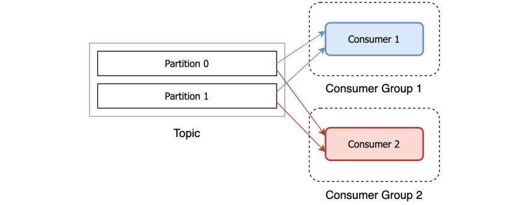

# Streaming logs


If you have any questions about the real-time log streaming service, please contact us at [support@transparentedge.eu](mailto:support@transparentedge.eu).


To activate the real-time log streaming service, simply access the dashboard at [https://dashboard.transparentcdn.com/](https://dashboard.transparentcdn.com/) and go to the Logs section. In the Streaming tab, you will find everything you need.

Once the service is activated, **you can download a zip** file that contains the necessary digital certificates to authenticate your consumers, as well as a set of preconfigured templates with your data for consuming logs using Filebeat, Logstash, and Python.

Furthermore, **you can easily add the IP addresses** where you will install the consumer(s), so that the necessary firewall rules are automatically adjusted in our brokers.

The templates are preconfigured with all the necessary data, but let's go through the contents of the zip file and certain important requirements and parameters to consider. One very important parameter is the Consumer Group.

#### Connection Parameters:

* The address of our brokers:
  * kafka1.edgetcdn.io&#x20;
  * kafka2.edgetcdn.io&#x20;
  * kafka3.edgetcdn.io
* The port to use, which will be 9093

#### Contents of the zip:

* Client's public certificate: **`c<ID>.crt.pem`**&#x20;
* Client's private certificate: **`c<ID>.key.pem`**&#x20;
* Keystore in PKCS12 format: **`c<ID>.keystore.p12`**&#x20;
* The password used to encrypt the keystore and truststore: **`password.txt`**&#x20;
* Public certificate of our CA: **`transparentcdnCA.pem`**&#x20;
* Truststore with our CA (required in some consumers): **`truststore.p12`**&#x20;
* Filebeat template: **`filebeat.yml`**&#x20;
* Logstash template: **`kafka-logstash.conf`**&#x20;
* Simple Python consumer: **`consumer.py`**

#### Other data:

* The Topic to subscribe to will be **`c<ID>`**
* **The prefix of the Consumer Group to join your consumers.** For example, if your `ID` is `83`, you will subscribe to the topic `c83`, and you can join your consumers to any "Consumer Group" starting with `c83_`, such as `c83_group1`, `c83_test`, `c83_pre`... You can find more information about consumer groups [here.](streaming-logs.md)

#### We will need:&#x20;

* The IP address(es) from where your consumers will connect. You can add them from the dashboard (please allow a margin of 5 minutes for them to be active on our firewall).

<figure><figcaption></figcaption></figure>

## Consuming the logs

Currently, there are numerous destinations for your logs. You may be interested in ingesting them into Elasticsearch for data analytics, or perhaps uploading them to a third-party service like Datadog or Amazon S3. The options are nearly endless and will greatly depend on your business needs.

That's why, staying true to our philosophy of keeping things as simple as possible, we are going to suggest that you use two widely used tools in the community: [Filebeat](https://www.elastic.co/es/beats/filebeat) and/or [Logstash](https://www.elastic.co/es/logstash/) to consume your logs from our Streaming Log system.

### Filebeat vs Logstash

It is very common, especially for people who are not familiar with these types of technologies, to confuse when to use Logstash, when to use Filebeat, or when to use them together, which is also possible. Here we will try to explain it in a somewhat simplified manner so that you can make a decision on this matter.

Logstash is a Java-based program that is part of the ELK stack (Elasticsearch - Logstash - Kibana) developed and maintained by ElasticSearch company.

On the other hand, Filebeat is written in Go by the same company and emerged as a response to the growing community need for a lightweight tool to transport logs since Logstash consumes more resources being written in Java.

Filebeat, as I mentioned, is a very lightweight software that allows you to transport logs from one place to another, similar to Logstash (although Logstash is not as lightweight). However, Logstash is much more versatile and powerful than Filebeat. It allows you to consume logs (inputs) from a greater number of sources and send them to a greater number of destinations (outputs).

Here are the links to the Logstash and Filebeat Input and Output documentation:

* Filebeat ([Input](https://www.elastic.co/guide/en/beats/filebeat/current/configuration-filebeat-options.html), [Output](https://www.elastic.co/guide/en/beats/filebeat/current/configuring-output.html))
* Logstash ([Input](https://www.elastic.co/guide/en/logstash/current/input-plugins.html), [Output](https://www.elastic.co/guide/en/logstash/current/output-plugins.html))

Therefore, using Logstash or Filebeat to retrieve logs from our Log Streaming system will depend on your specific needs, especially the final destination of the logs, the log rate per second, and whether you require any log transformations.

In summary, our recommendation is to use Filebeat whenever possible since it is lighter and easier to configure. If you need an output that is not supported by Filebeat or require log transformations, then you can use Logstash.

Remember that you always have a third option, which is also valid and considered in this documentation, which is to write your own consumer using your favorite programming language.

### Consuming logs using Filebeat

Let's now go through a simple deployment of Filebeat on a Debian server as a first step, where we will store the logs in a text file.&#x20;

The official documentation can be found at: [https://www.elastic.co/guide/en/beats/filebeat/current/index.html](https://www.elastic.co/guide/en/beats/filebeat/current/index.html)&#x20;

We will use the following example data, but remember that the zip file you downloaded after activating the service already contains a template called **`filebeat.yml`** with all the necessary information.

* Certificates `c83.crt.pem` y `c83.key.pem`
* Password: `password`
* Topic: `c83`
* Consumer group: `c83_filebeat`\


First, we download and install the Filebeat package on our server:

```
curl -L -O https://artifacts.elastic.co/downloads/beats/filebeat/filebeat-7.9.0-amd64.deb
sudo dpkg -i filebeat-7.9.0-amd64.deb
```

We enable the Kafka module:

```
filebeat modules enable kafka
filebeat setup -e
```

We edit the Filebeat configuration `/etc/filebeat/filebeat.yml` and paste the data we have in the **`filebeat.yml`** template. You will need to edit the following parameters if you copy the certificates to different locations or modify the path where the files will be dumped:

* `ssl.certificate:` Location of `c<ID>.crt.pem`
* `ssl.key:` Location of `c<ID>.key.pem`
* `ssl.certificate_authorities:` Location of `transparentcdnCA.pem`
* `path:` Final destination path where the consumed logs will be deposited _Filebeat_.

```
filebeat.inputs:
- type: kafka
  hosts:
    - kafka1.edgetcdn.io:9093
    - kafka2.edgetcdn.io:9093
    - kafka2.edgetcdn.io:9093
  topics: ["c83"]
  group_id: "c83_filebeat"
  initial_offset: "newest"
  ssl.enabled: yes
  ssl.certificate: "/etc/filebeat/secret/c83.crt.pem"
  ssl.key: "/etc/filebeat/secret/c83.key.pem"
  ssl.key_passphrase: "password"
  ssl.certificate_authorities:
    - /etc/filebeat/secret/transparentcdnCA.pem

output.file:
  codec.format:
    string: '%{[message]}'
  path: "/tmp/filebeat"
  filename: kafka-filebeat.out
  rotate_every_kb: 50000
```

On the server where you configure Filebeat, copy the public and private key of the certificate, as well as the Transparent Edge Services CA, to the paths you have defined in the configuration.&#x20;

You will also need to create the folder defined in the `path` if it doesn't exist.&#x20;

Once everything is configured, you just need to start the Filebeat service, usually using systemd with the command `systemctl start filebeat`. If everything goes well, you will see logs being consumed in the path you defined in `path:`.

```
root@filebeat:/tmp/filebeat# ls -lrt
total 4
-rw------- 1 root root     49M ago 27 08:43 kafka-filebeat.out.7
-rw------- 1 root root     49M ago 27 08:43 kafka-filebeat.out.6
-rw------- 1 root root     49M ago 27 08:43 kafka-filebeat.out.5
-rw------- 1 root root     49M ago 27 08:44 kafka-filebeat.out.4
-rw------- 1 root root     49M ago 27 08:44 kafka-filebeat.out.3
-rw------- 1 root root     49M ago 27 08:45 kafka-filebeat.out.2
-rw------- 1 root root     49M ago 27 08:51 kafka-filebeat.out.1
-rw------- 1 root root    4,6M ago 27 08:52 kafka-filebeat.out
```

### Consuming logs using Logstash

Now let's see how to consume our logs using Logstash.


Note: We will use the Keystore and Truststore instead of the private-public key pair, so you will need to copy them to the server where you run Logstash. Additionally, the default Systemd service uses the Logstash user, so it should have read permissions for these files. For the example, we will leave them in `/etc/logstash/certs.`


We will install Logstash from the official package repository. Execute the following commands to add the repository and install Logstash. Alternatively, you can follow the official guide at [https://www.elastic.co/guide/en/logstash/current/installing-logstash.html](https://www.elastic.co/guide/en/logstash/current/installing-logstash.html)

```
wget -qO - https://artifacts.elastic.co/GPG-KEY-elasticsearch | sudo apt-key add -
apt install apt-transport-https

echo "deb https://artifacts.elastic.co/packages/7.x/apt stable main" | sudo tee -a /etc/apt/sources.list.d/elastic-7.x.list
apt update
apt install logstash
```

Now we will configure a pipeline that will consume logs from our Kafka servers and dump them into a JSON file, categorizing each log field.


Remember that Logstash offers multiple inputs/outputs to different systems and allows you to customize and mutate logs. For more information, please refer to the following resources: ([Input plugins](https://www.elastic.co/guide/en/logstash/current/input-plugins.html), [Output plugins](https://www.elastic.co/guide/en/logstash/current/output-plugins.html)).


To do this, create a new file in `/etc/logstash/conf.d/kafka-logstash.conf` with the content you received in the `kafka-logstash.conf` template in the zip file you downloaded from the panel. You will need to edit the following parameters if you copy the certificates to different locations or modify the file dumping path:

* `ssl_keystore_location:` Location of `c<ID>.keystore.p12`
* `ssl_truststore_location:` Location of `truststore.p12`
* `path => :` File dumping path

```
input {
  kafka {
    bootstrap_servers => "kafka1.edgetcdn.io:9093,kafka2.edgetcdn.io:9093,kafka2.edgetcdn.io:9093"
    topics => "c83"
    group_id => "c83_logstash"
    auto_offset_reset => "latest"
    security_protocol => "SSL"
    ssl_keystore_location => "/etc/logstash/certs/c83.keystore.p12"
    ssl_keystore_password => "password"
    ssl_truststore_location => "/etc/logstash/certs/truststore.p12"
    ssl_truststore_password => "password"
  }
}

filter {
  grok {
    match => {
        "message" => [
            "%{DATA:clientip} - %{DATA:user} \[(.*)\] \"%{WORD:verb} %{DATA:request} %{DATA:httpversion}\" %{NUMBER:statuscode} %{DATA:bytes} \"%{DATA:useragent}\" %{DATA:hitmiss} \"%{DATA:content-type}\" \"%{DATA:layer}\" %{NUMBER:requesttime} \"%{DATA:clientid}\" \"%{DATA:referer}\" %{DATA:forwardedproto} %{DATA:country}(.*)",
            "%{DATA:clientip} - %{DATA:user} \[(.*)\] %{DATA:vod_host} \"%{WORD:verb} %{DATA:request} %{DATA:httpversion}\" %{NUMBER:statuscode} %{DATA:bytes} \"%{DATA:referer}\" \"%{DATA:useragent}\" \"%{DATA:content-type}\" \"%{DATA:hitmiss}\" \"%{DATA:layer}\" \"%{DATA:clientid}\" %{NUMBER:requesttime} %{DATA:forwardedproto} %{DATA:country}(.*)",
            "%{DATA:clientip} - %{DATA:user} \[(.*)\] %{DATA:vod_host} \"%{WORD:verb} %{DATA:request} %{DATA:httpversion}\" %{NUMBER:statuscode} %{DATA:bytes} \"%{DATA:referer}\" \"%{DATA:useragent}\" \"%{DATA:content-type}\" \"%{DATA:hitmiss}\" \"%{DATA:layer}\" \"%{DATA:clientid}\" %{NUMBER:requesttime} %{DATA:forwardedproto}(.*)"
        ]
    }
  }
  date {
    match => [ "timestamp" , "dd/MMM/yyyy:HH:mm:ss Z" ]
  }
  mutate { remove_field => [ "message" ] }
}

output {
 file {
   path => "/var/log/tcdn_streaming/logstash.out"
   codec => json_lines
 }
}
```

Since the service will be running with the user "logstash", we need to ensure that we have the correct permissions for the certificates, configuration, and the final directory where Logstash will write:

```
chown logstash:logstash -R /etc/logstash/
mkdir /var/log/tcdn_streaming
chown logstash:logstash /var/log/tcdn_streaming
```

Now all that's left is to start Logstash. We can do it through the command line to verify that everything is working correctly:

```
sudo -u logstash /usr/share/logstash/bin/logstash "--path.settings" "/etc/logstash"
```

Remember to verify that all the necessary files are accessible by the "logstash" user, including the certificates and the destination file + folder.&#x20;

After a few seconds, you will start receiving the logs in the file or output that you have specified in JSON format. Here's an example:

```c
 root@logstash:/var/log/tcdn_streaming# tail -1 logstash.out | jq
{
  "requesttime": "0.000193",
  "hitmiss": "hit",
  "clientid": "83",
  "verb": "GET",
  "content-type": "application/javascript",
  "httpversion": "HTTP/1.1",
  "bytes": "621",
  "request": "http://www.ejemplo.com/build/js/Core/Core.3160595ce5a674e1205b409c3e53616c4b44a9b3.js",
  "referer": "https://referer.ejemplo.com/",
  "user": "-",
  "forwardedproto": "https",
  "clientip": "11.11.222.111",
  "@version": "1",
  "statuscode": "200",
  "layer": "L1",
  "useragent": "Mozilla/5.0 (iPhone; CPU iPhone OS 13_7 like Mac OS X) AppleWebKit/605.1.15 (KHTML, like Gecko) Version/13.1.2 Mobile/15E148 Safari/604.1",
  "@timestamp": "2020-09-14T12:44:19.475Z"
}
```

If everything went well, you can cancel the previous command and let the service run with:

```
systemctl start logstash.service
```

### Consuming logs through a custom Python script

You can write a consumer in many different programming languages. Let's see an example using Python, using the "confluent-kafka-python" client or library at [https://github.com/confluentinc/confluent-kafka-python](https://github.com/confluentinc/confluent-kafka-python).&#x20;

Another popular option is [https://github.com/dpkp/kafka-python](https://github.com/dpkp/kafka-python).

Here's the example (once again, we'll use Debian as the operating system):&#x20;

We install the necessary packages:

```
sudo apt install python3-pip
pip3 install confluent-kafka --user
```

We create the Python file with the content you received in the `consumer.py` template. Below are some example data. The important part is the configuration section. You will need to edit the following parameters if you copy the certificates to different locations:

* `ssl.ca.location:` Ubicación de `transparentcdnCA.pem`
* `ssl.keystore.location:` Ubicación de `c<ID>.keystore.p12`

```c
#!/usr/bin/python3
import sys
import logging
import socket
from confluent_kafka import Consumer

LOG_FMT = '[%(asctime)s][%(levelname)s] %(message)s'
logging.basicConfig(
    stream=sys.stdout,
    format=LOG_FMT,
    datefmt='%Y.%m.%d %H:%M:%S',
    level=logging.INFO)

def assigned(consum, parti):
    logging.info("Assigned consumer: %s on partition %s", repr(consum), repr(parti))

def revoked(consum, parti):
    logging.error("Failed to assign consumer: %s on partition %s", repr(consum), repr(parti))

if __name__ == "__main__":
    # CONFIGURACION
    SERVERS = 'kafka1.edgetcdn.io:9093,kafka2.edgetcdn.io:9093,kafka3.edgetcdn.io:9093'
    TOPIC = 'c83'
    CONF = {'bootstrap.servers': SERVERS,
            'client.id': socket.gethostname(),
            'security.protocol': 'SSL',
            'ssl.ca.location': '/usr/local/share/ca-certificates/transparentcdnCA.pem',
            'ssl.keystore.location': '/root/secret/c83.keystore.p12',
            'ssl.keystore.password': 'password',
            'group.id': TOPIC + '_python'}
    # FIN CONFIGURACION

    consumer = Consumer(CONF)
    consumer.subscribe([TOPIC], on_assign=assigned, on_revoke=revoked)
    count = 0
    try:
        while True:
            msg = consumer.poll(1.0)
            if msg is None:
                #logging.info("Waiting for message or event/error in poll()")
                continue

            if msg.error():
                logging.error(msg.error())
            else:
                value = msg.value()
                offset = msg.offset()
                topic = msg.topic()
                logging.info("Mensaje recibido numero {} - Value: \"{}\" - Topic: {} - Offset: {}".format(
                    str(count),
                    value.decode('utf-8'),
                    str(topic),
                    str(offset)))

                count += 1

    except KeyboardInterrupt:
        pass
    finally:
        consumer.close()
```

If everything is correct, upon starting the consumer, you will receive the following message and begin consuming from the topic:

```
root@server1:~# ./consumer.py
[2020.08.21 09:57:21][INFO] Assigned consumer: <cimpl.Consumer object at 0x7fada8213f28> on partition [TopicPartition{topic=c83,partition=0,offset=-1001,error=None}, TopicPartition{topic=c83,partition=1,offset=-1001,error=None}]
```

## What are Consumer Groups?

Traditionally, message brokers operated in two ways:

* **Queue:** Messages are published once and consumed once.
* **Pub/Sub:** Messages are published once and consumed multiple times.

Kafka can operate in both ways thanks to Consumer Groups:

* If we want to act as a queue, we put all consumers in the same consumer group.
* If we want to act as a pub/sub, each consumer goes in a different group.

### Examples&#x20;

Currently, we create topics with 2 partitions by default (which can be increased upon request). Let's see some examples with a topic with 2 partitions:

* We start 3 consumers, all in the **same consumer group.** One of them consumes from partition 0, another from partition 1, and the last one remains idle. This achieves parallel processing and high availability. (High availability can also be achieved with 2 consumers: if one fails, the other will consume from both partitions). Messages will be distributed between consumer 1 and consumer 2.

<figure><figcaption></figcaption></figure>

* We start 2 consumers, each in a **different consumer group:** Both will receive ALL messages from the topic and will be completely isolated. This is useful if we want to perform different processing on the received messages for each consumer. We can add more consumers to this scheme, and the result will be the same: each of them will receive all messages from all partitions.\


<figure><figcaption></figcaption></figure>

Since we work with logs, and unless multiple different post-processes are required, it is most interesting to have the consumers in the same consumer group. **It is highly likely that only one consumer is sufficient given the performance offered by Kafka.** Additional consumers can be started if one of them cannot consume in real-time or if we want parallel processing + high availability.

## Consuming WAF Logs

If you have the WAF service enabled, you can also consume real-time audit logs. Unlike the delivery service, these logs are in JSON format.&#x20;

You can use the Python consumer mentioned earlier, with the only difference being the topic to which you subscribe. In this case, the topic will have the following format: `c<ID>_waf`.&#x20;

For example, if your company has the `<ID>` (client identifier) 83, you should subscribe to the topic `c83_waf`.

### Audit Log Format&#x20;

The format of the WAF service is a standard JSON object.&#x20;

This JSON contains all the relevant request data: the HTTP code, response headers, request headers, URL, method, client IP..., basically all the information. Additionally, it contains a field with all the details related to the attack detected.


It refers to the fields by separating them with a dot, as it is the notation used in jq, a JSON processor. For example, if we refer to the field `.transaction.messages.message`in `jq`, in Python it would be: `["transaction"]["messages"]["message"]`


A single request can trigger one or multiple WAF rules, which is why the field `.transaction.messages` is an array of different messages.

To facilitate the handling of logs, we send them from the CDN by separating each attack. Therefore, the field `.transaction.messages` ceases to be an array and becomes a single JSON object that contains the information of a single attack.

If a malicious user makes a POST request to `/wp-admin` and our CDN detects 2 attacks in the same request, you will receive 2 logs, each containing the information of one attack.

Here we access the "messages" field using `jq`, but we could also do it in Python or other languages. We examine the "message" field of the detected attack for each request.

```c
$ tail -3 audit.log | jq '.transaction.messages.message'
"Host header is a numeric IP address"
"Possible Remote File Inclusion (RFI) Attack: URL Payload Used w/Trailing Question Mark Character (?)"
"XSS Attack Detected via libinjection"
```

One of the important fields contained within `messages` is `ruleId`. It is a numerical value that allows us to set exceptions.&#x20;

Here is an example of the content of the `messages` field:

```c
{
  "message": "Description of the attack.",
  "details": {
    "match": "Technical message on why the request triggered this rule.",
    "ruleId": "931120",
    "file": "Path to the rule id 931120",
    "lineNumber": "78",
    "data": "Technical message with the elements from the request that triggered this rule id.",
    "severity": "2",
    "ver": "OWASP_CRS/3.3.2",
    "rev": "",
    "tags": [
      "application-multi",
      "language-multi",
      "platform-multi",
      "attack-rfi",
      "paranoia-level/1",
      "OWASP_CRS",
      "capec/1000/152/175/253"
    ],
    "maturity": "0",
    "accuracy": "0"
  }
}
```
