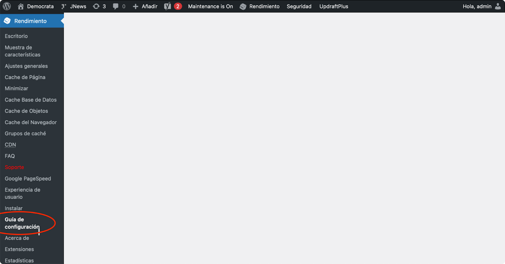
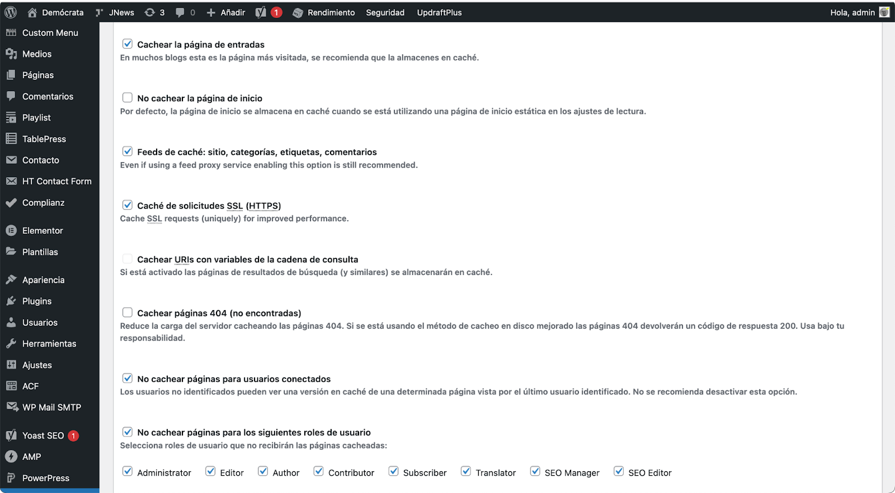
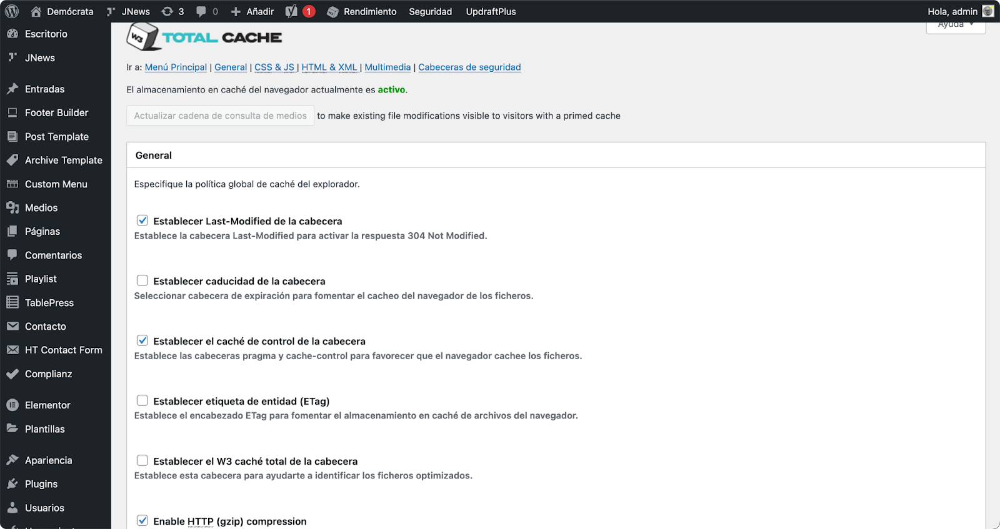
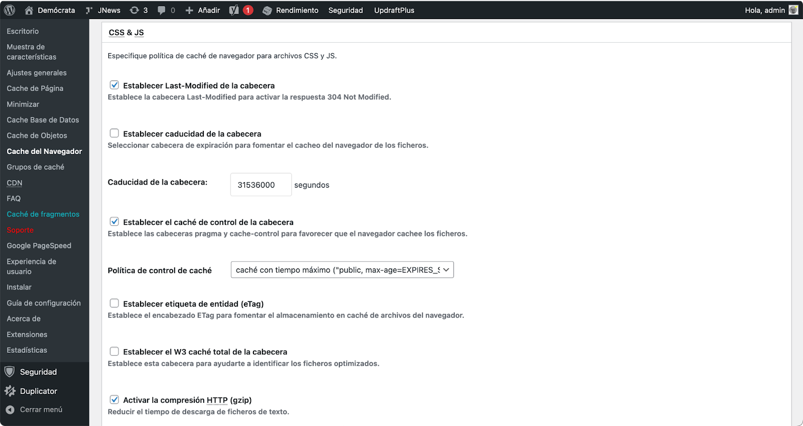
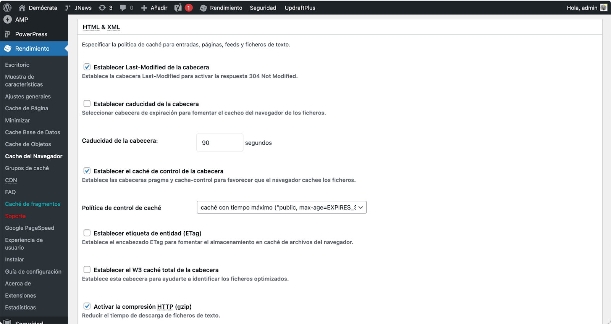

# Wordpress plugin

Before the installation

To properly configure the plugin, there are some interesting wp-config.php considerations before activating the cache.

#### Debug parameters

`define( 'WP_DEBUG', false );`

`define( 'WP_DEBUG_DISPLAY', true );`

`define( 'WP_DEBUG_LOG', false );`

`define( 'SAVEQUERIES', false );`

`define( 'SCRIPT_DEBUG', false );`

#### Limiting revisions

It is interesting to limit the number of saves we make of our pages and posts in the database:

`define( 'WP_POST_REVISIONS', 50 );`

If we are going to activate the Cron Job, we can remove the native WordPress cron:

`define( 'DISABLE_WP_CRON', true );`

We define a high autosave interval if it is a CMS with many editors, so as not to saturate the source:

`define( 'AUTOSAVE_INTERVAL', 360 );`

In case we want to limit the PHP limit:

`define( 'WP_MEMORY_LIMIT', '256M' );`

Self-emptying of the recycle garbage can so as not to saturate the database:

`define( 'EMPTY_TRASH_DAYS', 7 );`

We limit plugin editing and installation, and updates:

`define( 'DISALLOW_FILE_EDIT', false );`

`define( 'DISALLOW_FILE_MODS', true );`

`define( 'WP_AUTO_UPDATE_CORE', false );`

If we do not have redirect, we force SSL on login and backend, to avoid problems:

`define( 'FORCE_SSL_LOGIN', true );`

`define( 'FORCE_SSL_ADMIN', true );`

## Plugin installation

We install the plugin as you would install any WordPress plugin:

<figure><figcaption></figcaption></figure>

Once the plugin is installed as standard we configure the total cache in pro mode in the `wp-config.php` with: `define( 'W3TC_PRO', true )`;

After that we can move on to the configuration part within the WordPress backoffice, we start with the 'Configuration Guide', a submenu of the main menu of the plugin: 'Performance'.

<figure><figcaption></figcaption></figure>

This Wizard will allow us to test the basic caches before even registering the CDN and see what we have available on the machine (object cache, query cache, etc.).

<figure><figcaption></figcaption></figure>

We start with the page cache, obtaining different results depending on the origin. When in doubt, 'Disk: Enhanced' is best.

<figure><figcaption></figcaption></figure>

We continue with the database. In this case it is important to know if we have Memcached or Redis available, which would normally be the fastest options.

<figure><figcaption></figcaption></figure>

In the object cache, exactly the same, we will choose the one that best suits us from the options that we have installed in the source machine.

<figure><figcaption></figcaption></figure>

Then we continue with one of the most important: the browser cache test, where we will see if we can get cache control with the `max-age` and `s-maxage` headers.

<figure><figcaption></figcaption></figure>

We continue with the Wizard in the part of **lazy load** or deferred loading of images, which will help us a lot. Here we must be cautious with the options that the WordPress theme itself incorporates so as not to compete with it.

<figure><figcaption></figcaption></figure>

Once the setup has been completed and the basic features have been activated, we will go to the 'Show features' submenu, where we can install and review the basic features installed.

<figure><figcaption></figcaption></figure>

The PRO version of the plugin will allow us to install other available options that may be useful to us depending on the power of our template, layout builder, etc. This can be done in the 'Extensions' menu. Here we can activate or deactivate the ones we consider useful or not and adjust their values.

<figure><figcaption></figcaption></figure>

Once this is done, we register the Transparent Edge CDN and configure it in 'General Settings', being able to touch there all the values previously configured in the Wizard. We will find these options by activating the 'FSD CDN' checkbox when selecting 'TransparentCDN'.

<figure><figcaption></figcaption></figure>

Then we will add the company ID, client ID and client secret in the CDN menu - Configuration: Full-Site Delivery.

<figure><figcaption></figcaption></figure>

Once this is done, and if the 'Test Transparent CDN' check returns an OK, we could activate the values we want in 'General Settings'. Each activation will allow us to configure separately its values in its corresponding submenus.

Special attention should be paid to the options: minimize, object cache, browser cache and exclusions.&#x20;

Some examples of page cache configuration:

<figure><figcaption></figcaption></figure>

<figure><figcaption></figcaption></figure>

* Particularly interesting here is the option to cache posts, home pages, feeds, 404, and the options to not cache pages for logged in users and/or by roles.&#x20;
* It is very useful to preload cache via sitemap, although it should be activated with some care depending on the WP source.&#x20;
* We can also set the post purge policy, the type of feed to purge, etc.&#x20;
* Here we can also cache the API, an aspect that is very useful in the case of WordPress that do only "back" and have a decoupled front end.&#x20;
* We can set a more or less aggressive garbage collection interval or set the comment cookie, for example, very useful for a site with "forums".&#x20;
* We can define specific user-agents that we do not want to cache pages, or not cache pages with a specific cookie.&#x20;
* We can also exclude pages from caching, complete categories and tags, custom fields, authors, etc.
* In the same way, we can continue configuring the most interesting options, such as minify.

<figure><figcaption></figcaption></figure>

* Or the user's browser cache.

<figure><figcaption></figcaption></figure>

<figure><figcaption></figcaption></figure>

<figure><figcaption></figcaption></figure>

In any case, and as there are too many settings, we have prepared a plugin configuration file, which can be activated from 'General Settings > Import/Export Settings'. Download your configuration file [here](https://chat.transparentedge.eu/file-upload/dJxdRHgaK2migZA6W/w3totalcache.json?download).

<figure><figcaption></figcaption></figure>

With that we would have a starting point with many preconfigured options, where we would obviously need to review that they are suitable for our environment and configure the CDN client IDs with Transparent Edge, in addition to reviewing the options to see if they fit our objectives and cache policies.
