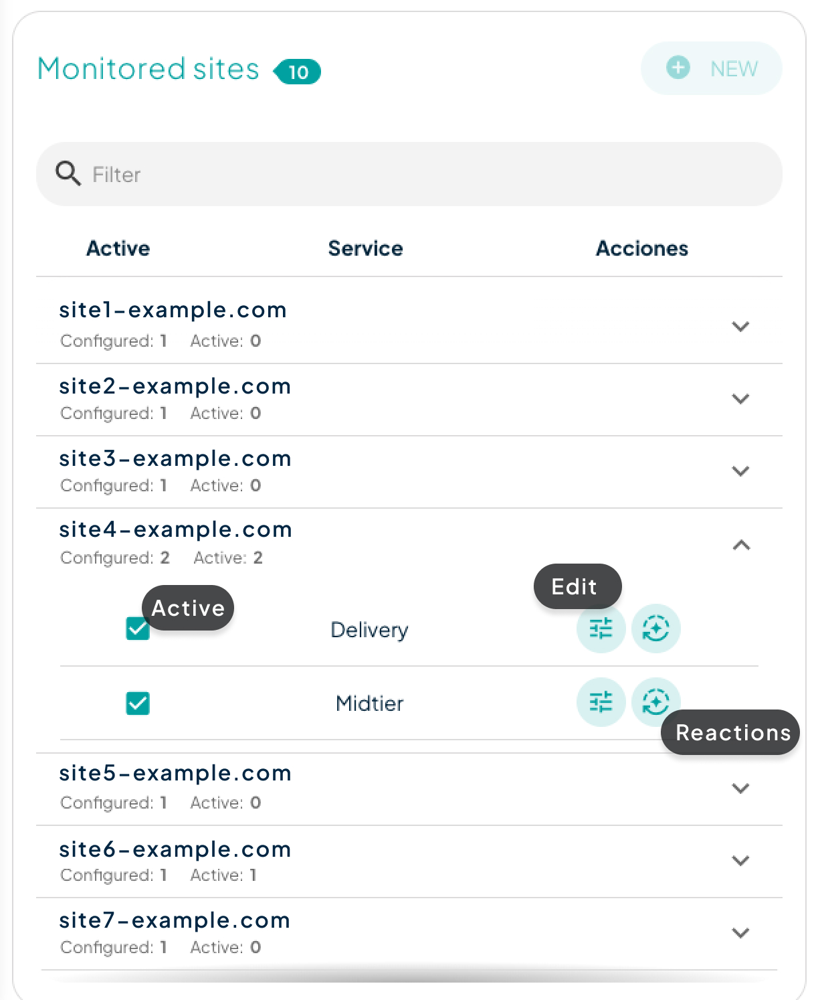

# Anomaly Detection

The anomaly detection system is a valuable tool that analyzes patterns and identifies disruptions in your website traffic, alerting you when they occur and providing the option to trigger our systems to react to an incident when necessary.

All our solutions include the option for monitoring a single site. If you wish to enhance the security of additional sites, we recommend contacting [sales@transparentedge.eu](mailto:sales@transparentedge.eu).

## How to activate

After accessing [the dashboard](https://dashboard.transparentcdn.com/auth/login), go to the 'Anomaly Detection' section. It is highly likely that the monitored sites and detection history will be empty. The 'New' button, located within the monitored sites, will allow you to create a new configuration.

<figure><figcaption>
Anomaly Detection section
</figcaption></figure>

When you click it, a modal will open in which you will select the site and service for which you want to configure anomaly detection. After this, the **types of anomalies and thresholds** will appear. A threshold is a fixed value or a percentage of the total requests. This limit indicates when an anomaly is considered to occur if the metric we are observing exceeds the specified value.

All parameters of the anomalies can only be modified if the service has been contracted, although a set of them is available in the _freemium_ version. Once the configuration has been created and saved, activating anomaly detection will be as simple as checking the box found in the dropdown menu of that site.

<figure><figcaption>
Active or edit Anomaly Detection
</figcaption></figure>

Remember that you can always go back and modify that configuration directly from the 'Settings' button, also present in the site's dropdown menu.\


[detection-types.md](detection-types.md)



[automatic-reactions.md](automatic-reactions.md)



[detection-history.md](detection-history.md)

