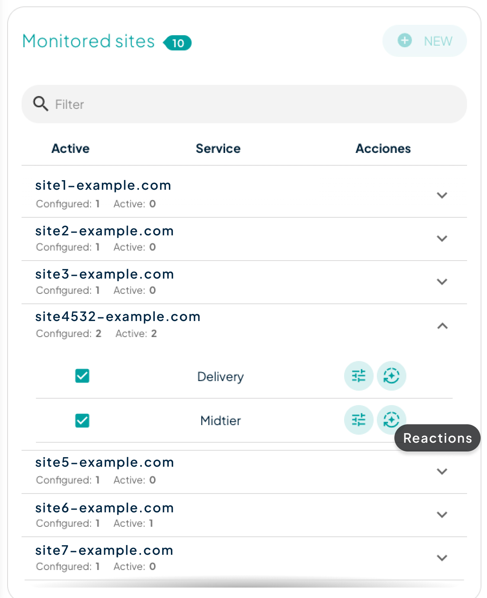

# Automatic Reactions

The automatic reactions feature allows for a **more agile response** to a potential vulnerability or attack on your site, such as when you are experiencing a Distributed Denial of Service (DDoS) attack. To configure them, it will be necessary to define a condition based on a threshold. Once established, the reaction will trigger when the value entered in the threshold is exceeded.

<figure><figcaption></figcaption></figure>

Reactions can only be configured if you have previously set up monitoring for your site. Then you will find the 'Reactions' button in the site dropdown menu.

Once the automatic reactions modal is open, you can select the type of anomaly for which you want the reaction and define the threshold at which that reaction will occur.

## Reactions Types

<figure><figcaption>
Creation of new reactions
</figcaption></figure>

* **Block IP:** If an IP is causing any anomaly, this reaction will block that IP and automatically include it in the blacklist.
* **Under attack mode:** If the threshold set for the chosen anomaly is exceeded at any time, the 'Under Attack' mode will be activated.
* **Callback to URL:** A call to the URL provided in the reaction will be made when the specified threshold is exceeded.
* **Email notification:** Notifications will be sent via email to the specified email addresses. Only emails of company users can be entered.
* **Slack notification:** A notification will be sent to any Slack-compatible chat system. You just need to enter the webhook address and the channel where you want to send the notification.
* **Captcha:** If an IP is causing any anomaly, this reaction will force a captcha to be performed for every request from that IP and automatically include it in the captcha list.
* **JS Challenge:** If an IP is causing any anomaly, this reaction will force a js challenge to be performed for every request from that IP and automatically include it in the js-challenge list.
* **Add to list:** If an IP is causing any anomaly, this reaction will include that IP to any of the network ACL lists specified in the configuration

### Reaction notification

When the **Email Notification Reaction** is enabled, all designated users will receive detailed information about detections based on the monitoring system that was triggered. Additionally, if other reactions are activated, they will also be included in the email notification.

For the [#crawler-ips-detection](detection-types.md#crawler-ips-detection "mention") type, reactions that involve actions against IP addresses (such as **Block IP**, **Captcha**, **JS Challenge**, or **Add to List**), will be executed based on the following two parameters:

* **Requests per Minute Threshold**: The reaction will be triggered if the number of requests per minute from an IP address exceeds the predefined threshold value.
* **Total Requests Threshold**: The reaction will also be triggered if the total number of requests from an IP address during the detection period exceeds **2.5 times the threshold value**.


Remember that to receive alert notifications, you must activate them in your [notification panel](https://dashboard.transparentcdn.com/user/notifications).

