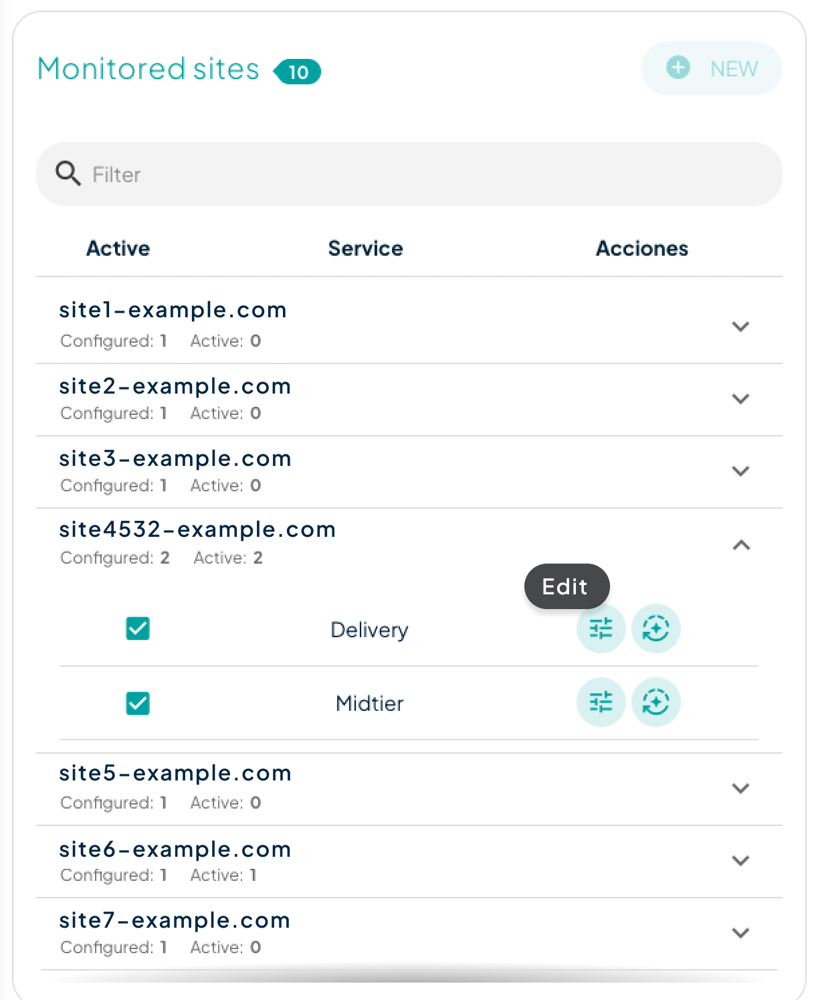

# Detection Types

## Traffic Anomaly Detection

Based on various statistics, we analyze traffic for an increase in requests or bandwidth. Additionally, the system searches for similar patterns in the past to determine if it is an anomaly or a recurring event. This detection, along with IP request detection, is very useful for identifying DDoS attacks.

Traffic anomaly detection is based on two factors:

1. The changes in your traffic between different periods, based on 95th percentiles.
2. The search for similar patterns in the past, to determine if we are facing an anomaly or if it is a recurring event that can occur on your site on a regular basis.

This detection may be more or less sensitive depending on the nature of your website, so we recommend you to adjust the detection values ​​so that the system alerts you when an anomaly is actually occurring.

The values that you can adjust are:

* **Sensitivity:** This setting is used as a multiplier of the 95th percentiles to determine whether we are facing an anomaly or not. It allows us to adjust the sensitivity of anomaly detection.
* **Minimum request per second threshold:** This setting allows us to configure the threshold above which the anomaly in your requests will occur, regardless of whether the system determines anomalous traffic. For example, if your 95th percentile of requests per second for the last 5 min exceeds the 95th percentile of the immediately previous period multiplied by the sensitivity factor, an anomaly would be triggered, as long as it exceeds the req/s threshold established.
* **Minimum bandwidth threshold:** This setting specifies the threshold in Mbps above which the anomaly in your bandwidth will occur, regardless of whether the system determines anomalous traffic.

Our recommendation for the **threshold** values is 3 times your average bandwidth and requests, although it may vary depending on the type of site.

<figure><figcaption>
Edit Anomaly Detection
</figcaption></figure>

## Hit ratio Anomaly Detection

The system detects when your website's hit ratio drops sharply. This may be due to several factors, such as a change in cache policies or someone attempting to attack your origin by bypassing the cache with random parameters.

The values that you can adjust are:

* **Sensitivity:** The maximum difference allowed on the hitratio of a given period in the past contrasted with the hitratio of the present. Depending on the type of site it may fluctuate. This value is in percentage.

## IP Anomaly Detection

This detection is based on the calculation of the average number of requests per second that each user of your website has. When the requests per second from an IP exceed 3 times the standard deviation, it is considered anomalous traffic and will trigger the alert as long as it is above the allowed sensitivity threshold.

For this detection, you can adjust:

* **Minimum IP threshold:** Establishes a maximum number of requests per second per IP below which anomalous traffic will not be considered.

## Response Time Anomaly Detection

It alerts you when the origin platform is taking longer to respond and response times spike above normal. This detection also relies on a normal distribution to identify those response times above the allowed threshold.&#x20;

Depending on the nature of your website, your origin may take more or less time to respond. For that, you can adjust these thresholds:

* **Maximum response time:** Number of seconds to consider a response time as anomalous. This setting may vary depending on the content of your site.
* **Minimum request per second threshold:** Sets the minimum number of requests per second necessary for the alert to occur.
* **Sensitivity:** The maximum increase allowed between the response time obtained in a given period contrasted against the current response time of the website. This value is in percentage.

## Status Code Anomaly Detection

It notifies **any substantial increase in 503 errors** on your website. Monitoring this type of error makes sense because in Transparent Edge, all 50x errors are masked with a status code 503, unless configuration overrides this behavior with the `X-Show-Origin-Errors` header.

For this detection you can adjust:

* **Minimum request per second threshold:** Select the minimum number of requests below which abnormal traffic will not be considered.

## Object Size Anomaly Detection

The system checks the variability in the average object size of the website, alerting us to any increase or decrease as long as it exceeds the configured sensitivity thresholds.

The values that you can adjust are:

* **Allowed increase in object size:** The maximum increase allowed between the two object size analyzed. This value is in percentage.

## Vulnerability Scanning Detection

This detection is based on the WAF system's positive detections for each of your websites. If the WAF blocks more than 30 requests from a single IP, it is considered suspicious scanning traffic. This will trigger an alert if it exceeds the allowed sensitivity threshold.

For this detection, you can adjust:

* **Minimum IP threshold:** Establishes a maximum number of requests per IP below which anomalous traffic will not be considered.

## Crawler IPs detection

This feature notifies you of any substantial increase in unique requests and content retrieval from a single IP on your website. Monitoring these anomalies helps detect potential suspicious bots attempting to find weaknesses in your site. Typically, these IPs have a lower request-per-second rate but retrieve a significant amount of content.

For this detection, you can adjust:

* **Minimum IP threshold:** Establishes a maximum number of **unique** requests per second per IP below which anomalous traffic will not be considered.
