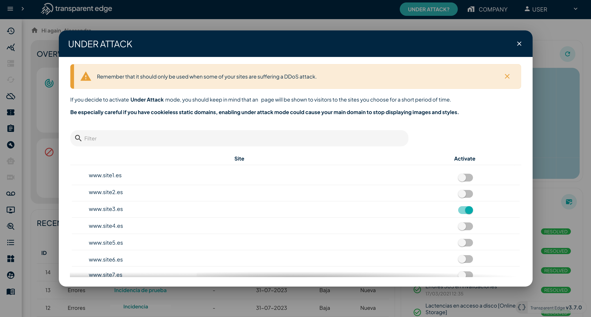

# Under attack mode

The Under attack mode feature acts as a protective shield for your website, **mitigating attempts of DDoS attacks and excessive bot traffic.**&#x20;

Under attack mode is an on-demand toggle. It can be triggered both manually and automatically through our API, enabling quick response to incidents.&#x20;

When Under Attack Mode is activated, our system filters all traffic reaching your website or application, identifying and blocking any malicious or suspicious traffic while allowing legitimate traffic to pass through smoothly.&#x20;

It is also effective against excessive bot traffic, which can overwhelm your server and negatively impact website performance. This unwanted traffic may come from malicious bots or legitimate web crawlers consuming a significant amount of resources.

Transparent Edge employs a variety of advanced techniques to identify and mitigate DDoS attacks, such as traffic pattern analysis, request rate calculation, response time variance, and malicious bot detection.

## How to activate it

To activate it, simply press the "Under attack?" button located at the top of your dashboard. A modal will appear, allowing you to select which of your sites is under attack using a toggle switch.

<figure><figcaption></figcaption></figure>

When you activate Under attack mode, visitors will be shown an interstitial page for a short period while their request is validated, after which they can continue browsing without any issues.

Remember to deactivate the mode for your sites once they are out of danger.

## Selective configuration

If you also have the [Anomaly Detection System](anomaly-detection/), you can configure Under Attack Mode as a [reaction](anomaly-detection/automatic-reactions.md) by adjusting detection parameters individually to customize its threshold and sensitivity based on the nature of each website or API.

You can enable Under Attack Mode for specific ASNs, countries, or IP ranges, URLs, domains... The configuration flexibility is comprehensive.

\

\
