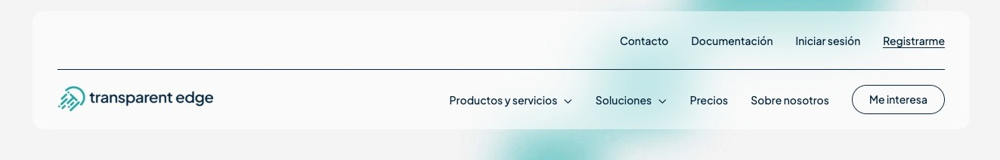
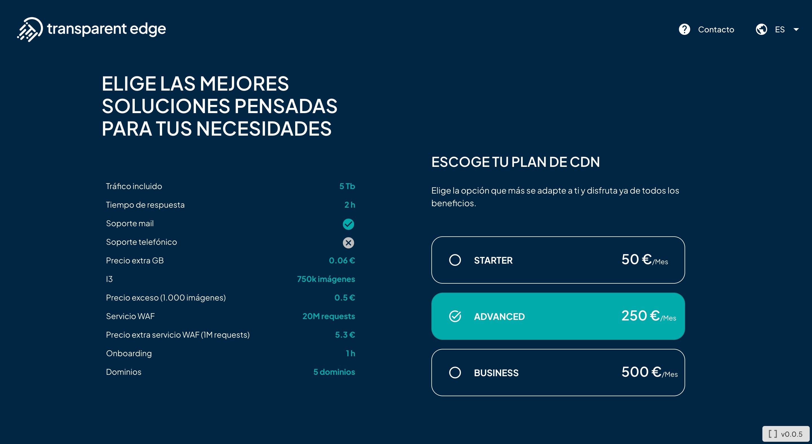
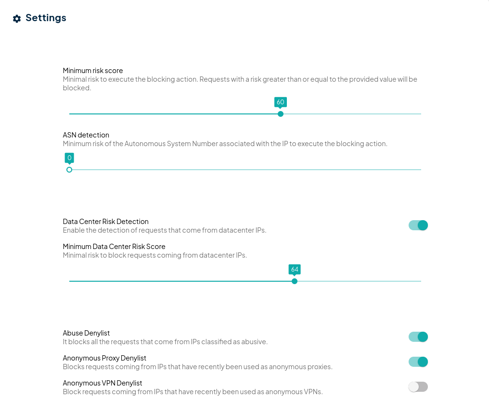

# Proceso de alta

### Registro

El proceso de registro en la plataforma de autoprovisionamiento de Transparent Edge Services se inicia a través del botón “Registrarme”, localizado en la esquina superior derecha de la página principal ([https://www.transparentedge.eu/](https://www.transparentedge.eu/)). Seleccionándolo, serás redireccionado al formulario disponible a tal efecto ([https://api.transparentcdn.com/signup/#/](https://api.transparentcdn.com/signup/#/)) y en él tendrás que completar dos pasos para hacer efectivo tu registro.

<figure><figcaption></figcaption></figure>

### Selección de paquete de solución

En primer lugar, será necesario elegir la solución que mejor se adapta a tus necesidades entre las siguiente opciones:

**Básico**

**Avanzado**

**Business**

Encontrarás información más detallada sobre cada uno de estos paquetes (tiempo de respuesta, tipo de soporte ofrecido, coste, etc.) en [https://www.transparentedge.eu/precios/](https://www.transparentedge.eu/precios/) Si tus necesidades cambian en el futuro, podrás solicitar la modificación de tu paquete de soporte a través de la dirección de correo electrónico [soporte@transparentedge.eu](mailto:soporte@transparentedge.eu).

<figure><figcaption></figcaption></figure>

### Datos básicos y de facturación

En este segundo paso tendrás la oportunidad de introducir un código promocional (_voucher_) en el espacio habilitado para ello dentro del resumen de **servicios contratados.** A continuación, debes rellenar los **datos básicos** siguientes:

#### Nombre y Apellidos

#### Dirección de correo electrónico

La dirección de correo electrónico es para Transparent Edge Services el principal medio de contacto contigo. Por eso es fundamental no solo que la dirección que nos des sea válida, sino también que tengas acceso a ella misma y -muy importante- que la consultes con frecuencia. Además, esta dirección de correo electrónico será el nombre de usuario con el que te autenticarás en la plataforma.

#### Página web

Tras tu nombre y apellidos y dirección de correo electrónico, será necesario que indiques el dominio principal de tu sitio web, por ejemplo: “[www.prueba.com](http://www.prueba.com/)”.

Una vez hayas completado el proceso de registro y accedas al panel (_dashboard_) de _autoprovisioning_ de Transparent Edge Services, podrás observar cómo el dominio introducido (_site_) ya ha sido añadido en la configuración de tu recién estrenado perfil. Por supuesto, tienes total libertad para añadir tantos nuevos dominios como precises o eliminar aquellos que ya no sean necesarios.

#### Contraseña

Deberás introducir una contraseña de, al menos, ocho caracteres y que contenga una mayúscula, una minúscula y un número para poder continuar con el proceso de registro.

<figure><figcaption></figcaption></figure>

Tras cumplimentar tus datos básicos, deberás rellenar aquellos campos referidos a **tus datos de facturación:**

**Empresa**

**CIF / NIF**

El código de identificación fiscal (CIF) de tu empresa o tu número de identificación fiscal (NIF).

**Dirección**

Es necesario rellenar todos los campos solicitados para poder continuar con el proceso de registro.

<figure><figcaption></figcaption></figure>

Una vez introducidos en el formulario de registro los datos necesarios, deberás seleccionar el _checkbox_ correspondiente con la aceptación de los términos y condiciones de uso de la plataforma. También deberás marcar el _checkbox_ de las condiciones general de contratación.

### Autorización de pago

En última instancia, deberás formalizar la autorización de pago. Para ello serás redireccionado a través de la pasarela de Transparent Edge Services y tendrás que introducir los datos relativos a tu tarjeta bancaria.

El cobro se realizará al final de cada mes en función tanto del paquete de soporte contratado como del consumo realizado.

En caso de que el método de pago elegido sea rechazado por parte de la pasarela, se te mostrará el correspondiente mensaje de error y serás nuevamente redireccionado al formulario de registro a fin de verificar los datos introducidos y modificarlos en caso de que hayas cometido algún error al introducirlos previamente.

## Activación de la cuenta de usuario

Una vez el proceso de registro haya concluido de manera exitosa, deberás necesariamente activar tu recién estrenada cuenta. Para ello será preciso hacer clic sobre el enlace “VERIFICA TU CORREO” que figura en el mensaje de bienvenida que recibirás en tu bandeja de entrada.

Este mensaje de bienvenida se envía automáticamente a la dirección de correo electrónico indicada en el formulario de registro una vez completado este. Dispondrás de 48 horas a partir de ese momento para confirmar tu correo. Hasta que la cuenta no haya sido activada, no tendrás acceso a la plataforma de _autoprovisioning_ de Transparent Edge Services.

En ese correo se te informará el CNAME (_Canonical NAME_) de Transparent Edge Services al que debes apuntar y ajustar el DNS.

Por ejemplo, nuestro registro CNAME asignado sería: caching.cNNN.edge2befaster.net.

Y además del CNAME, es importante que exista un fichero «tcdn.txt» en la raíz de tu sitio web con el contenido incluido en el correo de activación.&#x20;

En caso de no haber recibido ningún correo electrónico, revisa en primer lugar si ha llegado a la carpeta _spam_ de tu buzón. Si tampoco lo has recibido ahí, ponte en contacto con Transparent Edge Services a través de la dirección de correo altas@transparentedge.eu para que activemos manualmente tu cuenta de usuario.
